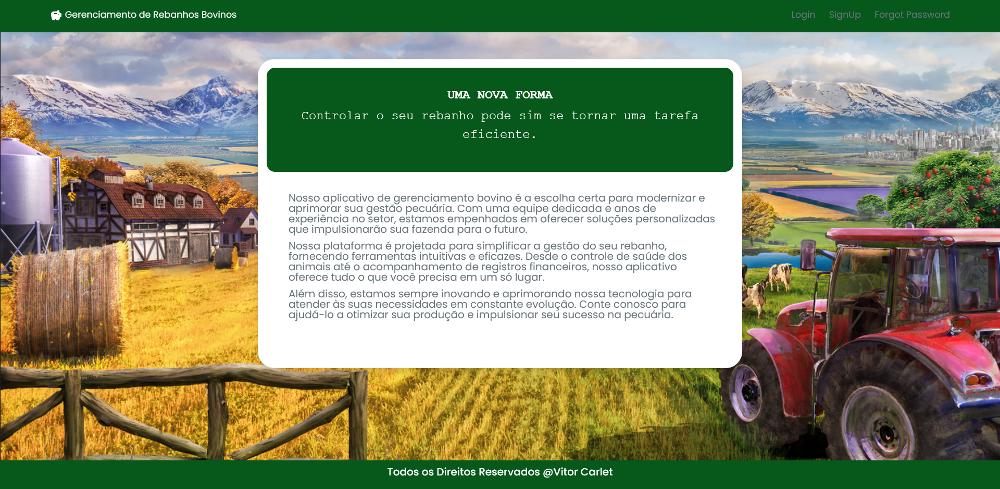
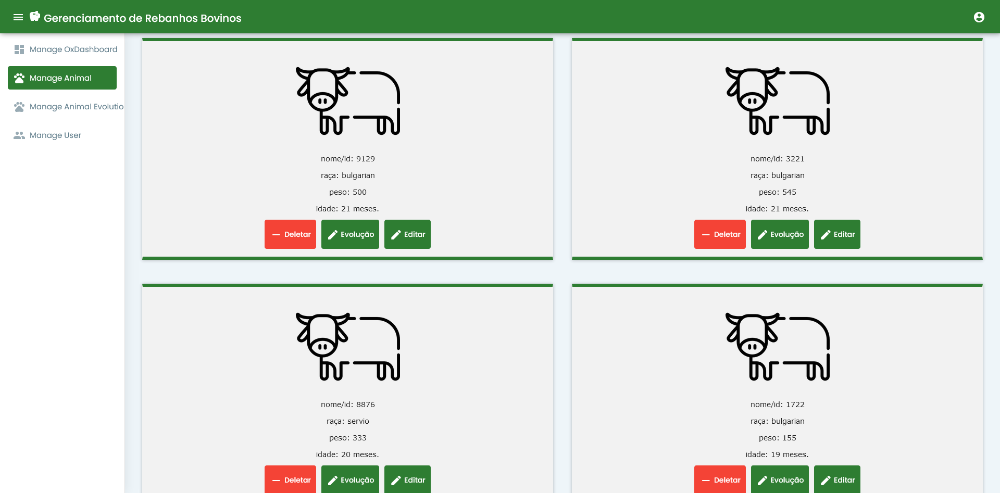

## BovinoApp - Gerenciamento de Gado Bovino

### Visão Geral

BovinoApp é um projeto que utiliza as seguintes tecnologias: Angular 11 e Spring Boot 4. Ele foi desenvolvido para auxiliar na gestão das operações relacionadas a uma fazenda de gado bovino. O aplicativo permite o armazenamento de dados dos bois, a geração de relatórios e a realização de consultas relevantes para o negócio. Além disso, ele pode notificar os usuários sobre mudanças no peso dos animais, garantindo que estejam de acordo com os padrões adequados.

### Páginas Principais

O BovinoApp consiste nas seguintes páginas principais:

1. **Página de Cadastro:** Permite o cadastro de novos animais na fazenda, incluindo informações como peso, idade, raça, e outras características relevantes.

2. **Página de Login:** Fornece autenticação segura para acessar o sistema, garantindo que apenas usuários autorizados possam utilizar o aplicativo.

3. **Página de Dashboard:** Apresenta gráficos e informações gerais sobre o rebanho, incluindo estatísticas, tendências de peso, e outros dados essenciais para a gestão da fazenda.

4. **Página dos Animais:** Lista todos os animais cadastrados na fazenda, permitindo a visualização rápida de detalhes individuais de cada animal.

5. **Página de Evolução de Peso:** Exibe o histórico de peso de cada animal, permitindo um acompanhamento visual da evolução de peso ao longo do tempo.

6. **Página de Valores dos Animais:** Apresenta o valor atual de cada animal com base nas informações registradas e nos preços atuais de mercado.

### Imagens do Projeto

Aqui estão algumas imagens do BovinoApp para uma visualização mais detalhada:

### Como Contribuir

Se você deseja contribuir para o desenvolvimento do BovinoApp, siga estas etapas:

1. Faça um fork deste repositório.
2. Clone o seu fork em sua máquina local.
3. Crie uma branch para a sua contribuição: `git checkout -b sua-feature`
4. Faça as alterações necessárias e adicione commits significativos.
5. Envie as alterações de volta para o seu repositório no GitHub.
6. Crie um pull request para o repositório principal.

Agradecemos sua contribuição para tornar o BovinoApp ainda mais eficaz no gerenciamento de gado bovino!

