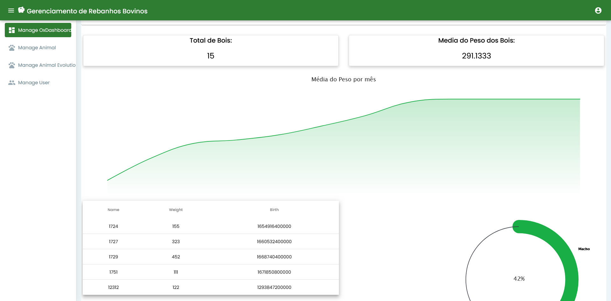

## BovinoApp - Bovine Cattle Management

### Overview

BovinoApp is a project that utilizes the following technologies: Angular 11 and Spring Boot 4. It has been developed to assist in the management of operations related to a cattle farm. The application enables the storage of cattle data, generation of reports, and the execution of business-relevant queries. Additionally, it can notify users about changes in the weight of animals, ensuring they are in compliance with appropriate standards.

### Key Pages

BovinoApp consists of the following key pages:

1. **Registration Page:** Allows for the registration of new animals on the farm, including information such as weight, age, breed, and other relevant characteristics.

2. **Login Page:** Provides secure authentication to access the system, ensuring that only authorized users can use the application.

3. **Dashboard Page:** Presents charts and general information about the livestock, including statistics, weight trends, and other essential data for farm management.

4. **Animal Page:** Lists all animals registered on the farm, allowing for quick viewing of individual details for each animal.

5. **Weight Evolution Page:** Displays the weight history of each animal, allowing for visual tracking of weight changes over time.

6. **Animal Values Page:** Presents the current value of each animal based on the recorded information and current market prices.

### Project Images

Here are some images of BovinoApp for a more detailed view:

### How to Contribute

If you wish to contribute to the development of BovinoApp, follow these steps:

1. Fork this repository.
2. Clone your fork to your local machine.
3. Create a branch for your contribution: `git checkout -b your-feature`.
4. Make the necessary changes and add meaningful commits.
5. Push the changes back to your GitHub repository.
6. Create a pull request to the main repository.

We appreciate your contribution to making BovinoApp even more effective in cattle management!
